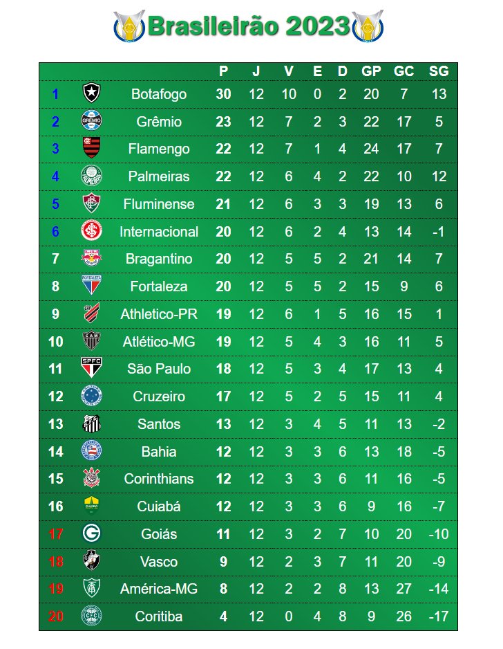

# Brasileirao

<label> ⚽ Descrição:

 Página usada para verificar a tabela do Campeonato Brasileiro em tempo real, com uso de API do site: https://www.api-futebol.com.br/

<label> ⚽ Instalação e Execução:

<li> Para instalar em seu computador você precisa clicar no botão verde escrito 'Code' e em seguida selecionar a opção 'Download Zip'. Ou, se preferir:

<li> Para executar é necessário que você tenha alguma ferramenta de extração de arquivos, como a winRAR, para extrair a pasta para o local no seu computador
que você deseja ter acesso. Depois, basta clicar no arquivo 'index.html'.

<label> ⚽ Uso da página: 

<li> Tabela atualizada em tempo real:

<label> ⚽ Ferramentas Utilizadas:

